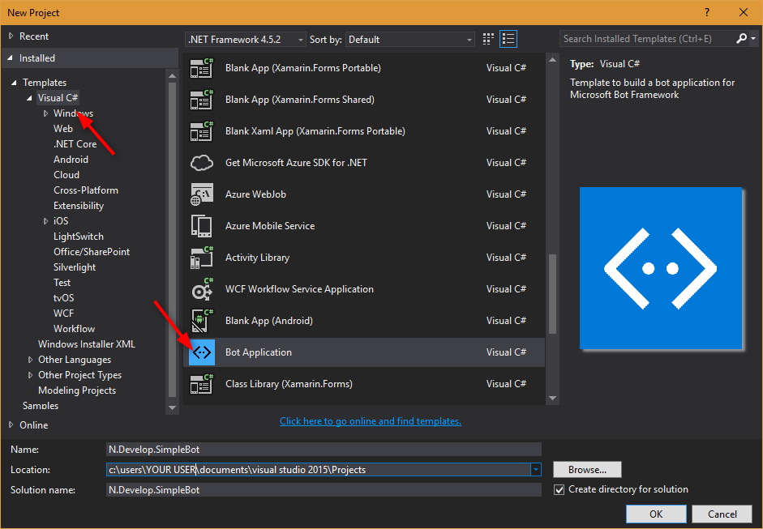
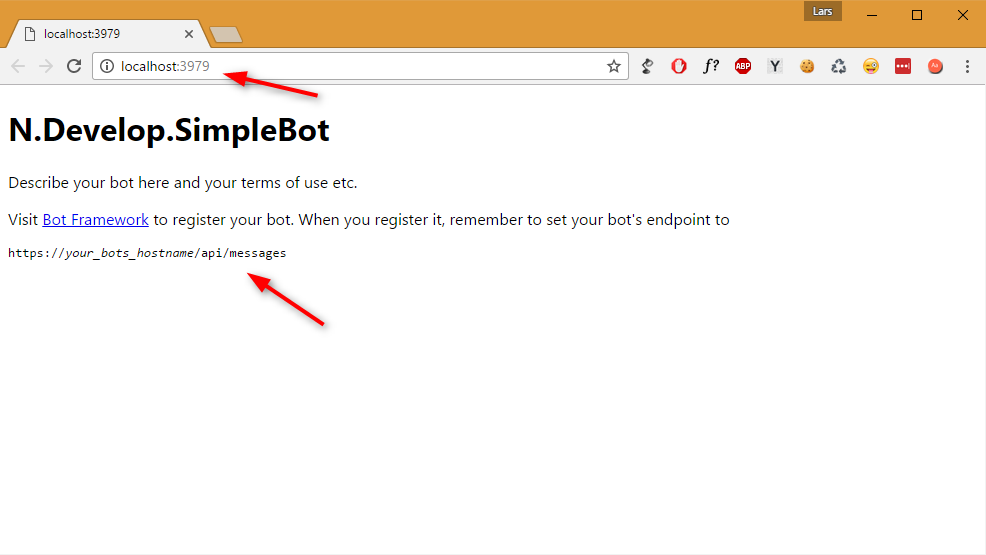
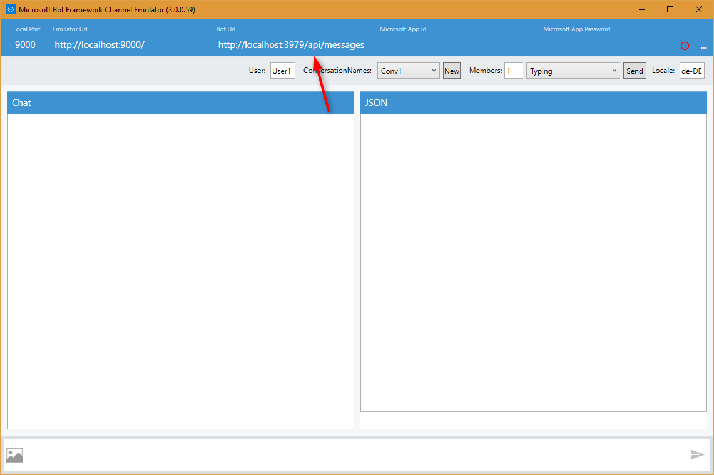
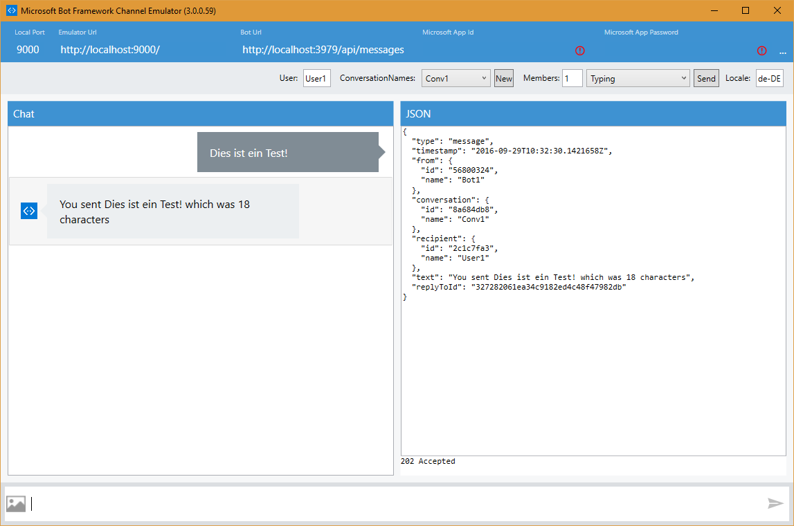
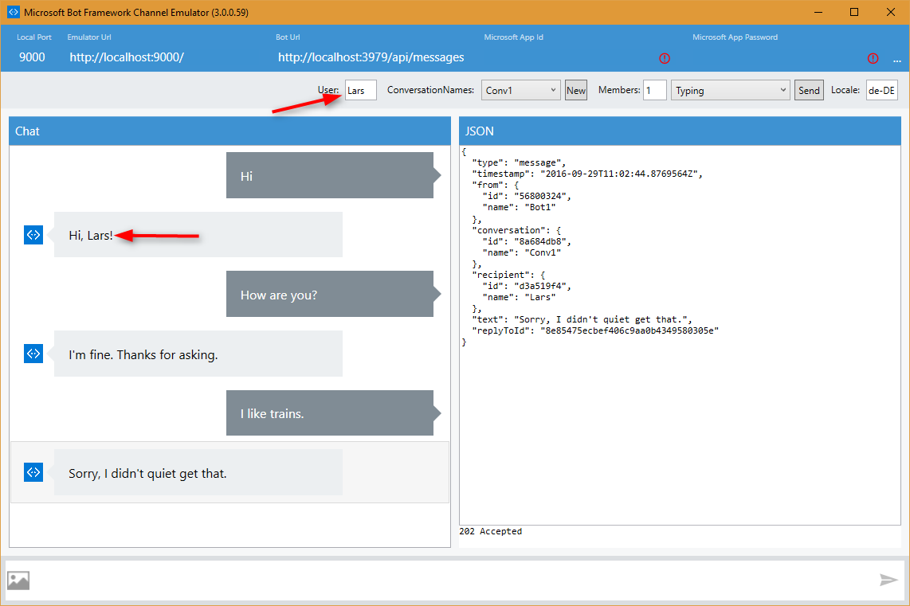

Title: Ein einfacher Bot mit dem Microsoft Bot-Framework
Published: 2016-09-28
Tags: ["Bots", "MS Bot Framework", "CSharp"]
---

Ich habe mich in den letzten Tagen etwas mit dem [Microsoft BotFramework](https://dev.botframework.com/) befasst.
Mit dem BotFramework stellt Microsoft eine wirklich einfach Möglichkeit zur Verfügung, eigene Bots zu entwickeln.
Wenn wir in diesem Kontext von einem **Bot** sprechen, sprechen wir von einem **Conversational User Interface**, kurz **CUI**.
Bei den diesen Bots geht es um die Steuerung über Sprache. Dabei spielt es keine Rolle ob die Befehle gesprochen
oder geschrieben werden. Der Bot nimmt den Satz auf und versucht daraus seinen Befehl abzuleiten.

Wir wollen heute einen Bot erstellen, der nichts weiter macht als ein paar einfache Reaktionen auf einfache Fragen zu geben. Um diesen Bot zu schreiben,
den man in eine Website, Skype, Telegram, Slack und andere Plattformen integrieren kann, bedarf es erstaunlich wenig Schritte<!-- Read More -->.

## Schritt 1: Die Projektvorlage

Einen sehr einfachen Einstieg in die Bot-Entwicklung bietet die entsprechende Visual Studio-Projektvorlage. Diese ist unter
[http://aka.ms/bf-bc-vstemplate](http://aka.ms/bf-bc-vstemplate) zu finden. Die Zip-Datei, die ihr über den Link bekommen habt,
kopiert ihr einfach, so wie sie ist, in `C:\Users\[DEIN USERNAME]\Documents\Visual Studio 2015\Templates\ProjectTemplates\Visual C#\`, oder
entsprechend dahin, wo ihr euer Visual Studio 2015-Userverzeichnis angelegt habt. Für die meisten User müsste der oben genannte Pfad aber passen.

Nun öffnet ihr einfach Visual Studio und erstellt ein neues Projekt auf Basis der neu hinzugefügten Projektvorlage.



### Vorsicht beim Update der NuGet-Packages

Wer so ähnlich veranlagt ist wie ich, geht oft zuerst in den Package-Manager und updated alle verfügbaren NuGet-Packages.
Dies ist hier leider nicht zu empfehlen. Nachdem ich alle Packages aktualisiert hatte, wollte mein Bot leider nicht mehr antworten.
Ich habe danach bisher auch noch keine Zeit darauf verwendet herauszufinden, welches Package die Probleme nach der Aktualisierung verursacht.

## Schritt 2: Die Bot-Vorlage testen

Die "nackte" Projektvorlage enthält bereits einen einfachen Bot. Dieser nimmt eine Nachricht entgegen und zählt die Anzahl der Zeichen, die
er dann als Antwort zurück an den User schickt. Bevor wir den Bot verändern, wollen wir diese Funktionalität erst testen.
Dazu starten wir die Solution einfach mit `F5`. Nun sollte sich der Browser eurer Wahl öffnen und ungefähr so aussehen:



Wie man dem Browser entnehmen kann, horcht der Bot nun auf einer bestimmten URL. In meinem Fall ist das `http://localhost:3979/api/messages`.

### Der Bot Framework Channel Emulator

Es gibt mehrere Möglichkeiten den Bot zu testen. So könnte man eine einfach Console-Application schreiben, über die man mit dem Bot kommuniziert.
Noch einfacher ist allerdings die Nutzung des Bot Framework Channel Emulators. 
Diesen findet ihr unter [https://aka.ms/bf-bc-emulator](https://aka.ms/bf-bc-emulator).

Diesen müsst ihr einfach installieren und im Anschluss starten.



Ihr müsst dann oben nur noch die URL zu eurem Bot eintragen und könnt danach direkt loschatten.



## Schritt 3: Den Bot anpassen

Um das Verhalten des Bots anzupassen, gehen wir in den `MessagesController`. Dieser nimmt die Nachrichten vom User entgegen.
Behandelt werden die Nachrichten in der `Post`-Methode. Dort wollen wir nun ein bisschen eigene Logik einfügen, um dem User das Gefühl einer
"echten" Konversation zu geben. Wir beschränken uns hier allerdings auf zwei einfache Reaktionen.

1. Wenn der User "Hi" schreibt, antwortet der Bot ebenfalls mit "Hi", gefolgt vom Namen des Nutzers.
1. Wenn der User "How are you?" schreibt, antwortet der Bot mit "I'm fine. Thanks for asking.".

Auf alles andere sagt der Bot "Sorry, I didn't quiet get that.".

Schauen wir uns zuerst einfach mal den Code an:

```csharp
/// <summary>
/// POST: api/Messages
/// Receive a message from a user and reply to it
/// </summary>
public async Task<HttpResponseMessage> Post([FromBody]Activity activity)
{
    if (activity.Type == ActivityTypes.Message)
    {
        var connector = new ConnectorClient(new Uri(activity.ServiceUrl));
        Activity reply;

        if ("hi".Equals(activity.Text?.ToLower()))
        {
            reply = activity.CreateReply($"Hi, {activity.From.Name}!");
        }
        else if ("how are you?".Equals(activity.Text?.ToLower()))
        {
            reply = activity.CreateReply("I'm fine. Thanks for asking.");
        }
        else
        {
            reply = activity.CreateReply("Sorry, I didn't quiet get that.");
        }

        // return our reply to the user
        await connector.Conversations.ReplyToActivityAsync(reply);
    }
    else
    {
        HandleSystemMessage(activity);
    }
    var response = Request.CreateResponse(HttpStatusCode.OK);
    return response;
}
```

Im Grunde ist der Code selbsterklärend. Die `Post`-Action prüft zuerst, ob es sich bei der Nachricht wirklich um einen Text-Nachricht vom User handelt, oder ob es sich
um eine andere Notification handelt. Handelt es sich um eine Text-Nachricht, können wir darauf reagieren.
Wir prüfen einfach mit einem if-else-Kostrukt, ob "hi" oder "how are you?" eingegeben wurde und verschicken unsere Reaktion direkt an den User zurück.

Alles Nachrichten, bei denen es sich nicht um eine Text-Nachricht vom User handelt, werden von der `HandleSystemMessage`-Methode behandelt.

### Let's have a conversation/conversensation

Nun wollen wir unseren Bot natürlich ausprobieren. Also starten wir die Solution wie gewohnt über `F5` und begeben uns in den Channel Emulator. Damit uns der Bot auch richtig anspricht, setzen wir oben noch unseren Namen ein und fangen einfach an zu chatten.



## Fazit

Wie wir sehen können, kommen wir mit dem Microsoft BotFramework und der entsprechenden Projektvorlage sehr schnell zu einem vorzeigbaren Ergebnis.
Auch wenn unser Bot nicht gerade besonders intelligent ist, könnt ihr euch sicher vorstellen, was man daraus mit ein bisschen einfacher Logik
zaubern kann.

Der "Entwicklungsaufwand" (wenn man es überhaupt so nennen darf), der in diesem Bot steckt, ist zwar sehr gering und sicher gut nachzubauen, 
ich habe mich aber dennoch entschieden, den Code auf GitHub zur Verfügung zu stellen. 
Das entsprechende Repository findet ihr unter [https://github.com/n-develop/N.Develop.SimpleBot](https://github.com/n-develop/N.Develop.SimpleBot).

Ein weiteren Blog-Posts werde ich auf die noch spannenderen Themen, wie intelligente Befehlserkennung mit **LUIS**
(Language Understanding Intelligent Service), **Dialoge** und den sogenannten **FormFlow** eingehen.

Nun wünsche ich euch erstmal viel Spaß beim Spielen mit dem BotFramework.