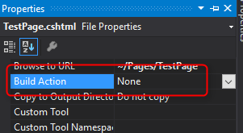
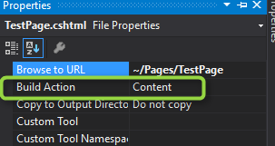

Title: Kurznotiz - Fehlende Views nach Deployment auf Azure WebApp
Published: 2016-06-04
Tags: ["Azure", "Kurznotiz"]
---
Vor ein paar Tagen hatte ich das Problem, dass manche Views nicht auf meiner Azure-WebApp deployed wurden.
Egal ob es über meinen Continuous Deployment-Prozess lief oder ich direkt über Visual Studio gepublished habe. Die Views kamen einfach nicht auf dem Server an.

Die Lösung war einfach. Aber die Suche nach dieser hat deutlich länger gedauert, als man denken sollte.
Ich hoffe, dass ich mit diesem Blog-Post für den ein oder anderen die Suche etwas verkürzen kann<!-- Read More -->.

Das Problem war schlicht und einfach die `Build Action`-Property der cshtml-Datei. Diese stand fälschlicherweise auf `None`.

Richtig wäre die Einstellung `Content`.

Das war es schon. Das nächste Deployment sollte nun alle bisher fehlenden Views beinhalten.