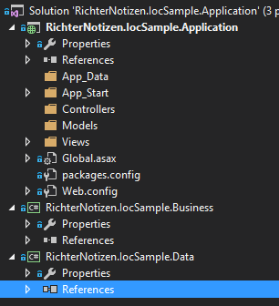
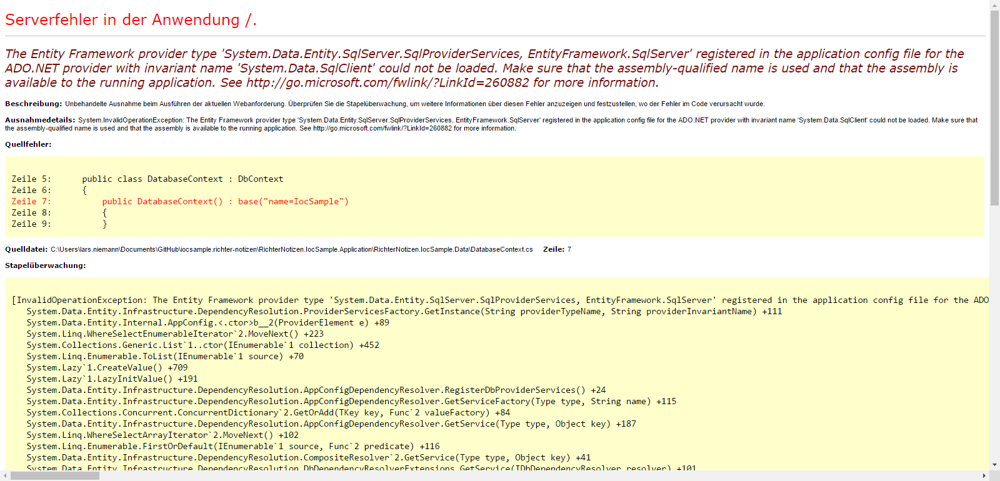
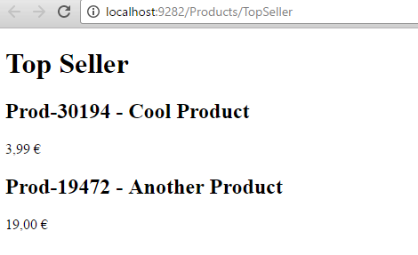

Title: Autofac in einer Multi-Project-Solution
Published: 2017-01-26
Image: ../images/blog-title-6.jpg
Tags: [Autofac, MVC, Dependency Injection, CSharp, .NET]
---

Ich halte Dependency Injection (DI) für eines der wichtigsten Prinzipien in der Softwareentwicklung. Handelt es sich um mehr als ein kleines Projekt
mit wenigen Klassen, kommt häufig ein IoC-Container zum Einsatz. Ich selbst bin ein Fan von [Autofac](https://autofac.org/).
Die Einrichtung von Autofac innerhalb eines einfachen Projektes ist sehr einfach und bereits in vielen anderen Blog-Posts beschrieben.
Wie aber funktioniert das Ganze, wenn ich mehrere Projekte innerhalb einer Solution habe. In vielen Solutions findet sich beispielsweise die allseits bekannte
3-Schichten-Architektur. Diese beinhaltet traditionell einen Data-Access-Layer, einen Business-Layer, sowie einen Presentation-Layer.
Welcher Layer für was zuständig ist, sollte jeden Entwickler, zumindest so ungefähr, klar sein.
Also was tun, wenn ich in dieser 3-Schichten-Architektur Autofac einsetzen will? Jede Schicht hat seine eigenen Komponenten, 
die dem IoC-Container hinzugfügt werden müssen. Und wie es sich für eine vernünftige 3-Schichten-Architektur gehört, soll jede Schicht nur auf die direkt
darunter befindliche Schicht zugreifen. Es ist also **keine** akzeptable Lösung, Autofac nur im Presentation-Layer zu referenzieren und dort alle Repositories,
Services und andere Komponenten aus den anderen beiden Schichten hinzuzufügen. Dies hieße nämlich, dass der Presentation-Layer direkt auf den Data-Access-Layer
zugreifen muss.

## Let's get started

Für genau dieses Szenario gibt es in Autofac **Module**. Diese erlauben es, unabhängige Module zu implementieren, die jeweiles ihre eigenen Komponenten
im IoC-Container registrieren.
Ein Beispiel sagt mehr als tausend Worte. Den Quellcode dieses Beispiels findet ihr unter
[https://github.com/n-develop/iocsample.richter-notizen](https://github.com/n-develop/iocsample.richter-notizen). Dort habe ich ganz bewusst während der Entwicklung
sehr kleinschrittig eingecheckt. Frei nach der Devise **Commit often. Commit early.** Wer also die Entwicklungsschritte genau nachvollziehen will, kann die
Commits einfach Schritt für Schritt durchgehen. Aber nun zu unserem Beispiel. Jetzt legen wir direkt los und erstellen eine neue Solution
und legen darin schon mal unsere drei Schichten in Formvon Projekten an. 

In diesem Beispiel ist es 
 * eine **ASP.NET Web Application** als Presentation-Layer,
 * eine **Class Library** als Business-Layer,
 * sowie eine **Class Library** als Data-Access-Layer.
 


## Autofac für alle

Damit jeder Layer sein eigenes Autofac-Module implementieren kann, muss jedes Project entsprechend das NuGet-Package referenzieren.
Der Data-Access-Layer und der Business-Layer geben sich mit dem Package "[Autofac](https://www.nuget.org/packages/Autofac/)" zufrieden.
Für den Presentation-Layer installieren wir "[Autofac.Mvc5](https://www.nuget.org/packages/Autofac.Mvc5/)".

Und wo wir gerade bei den NuGet-Packages sind, spendieren wir dem Data-Access-Layer auch noch ein "[EntityFramework](https://www.nuget.org/packages/EntityFramework)".
Wenn wir schon so eine Beispiel-Solution zusammenbasteln, soll sie zumindest von der Datenbank bis zur Razor-View funktionieren. :smile:
Da unser Presentation-Layer unser StartUp-Project ist, verschieben wir die Konfiguration aus der neu entstandenen `App.config` des Data-Access-Layers, in die
`Web.config` des Web-Projektes. Außerdem fügen wir einen Connectionstring hinzu, der die Verbindung zu unserer Datenbank definiert.

Alles in allem fügen wir folgende Zeilen an den Anfang der `Web.config` ein.

```xml
<configSections>
  <!-- For more information on Entity Framework configuration, visit http://go.microsoft.com/fwlink/?LinkID=237468 -->
  <section name="entityFramework" type="System.Data.Entity.Internal.ConfigFile.EntityFrameworkSection, EntityFramework, Version=6.0.0.0, Culture=neutral, PublicKeyToken=b77a5c561934e089" requirePermission="false" />
</configSections>
<entityFramework>
  <defaultConnectionFactory type="System.Data.Entity.Infrastructure.LocalDbConnectionFactory, EntityFramework">
    <parameters>
      <parameter value="mssqllocaldb" />
    </parameters>
  </defaultConnectionFactory>
  <providers>
    <provider invariantName="System.Data.SqlClient" type="System.Data.Entity.SqlServer.SqlProviderServices, EntityFramework.SqlServer" />
  </providers>
</entityFramework>
<connectionStrings>
  <add name="IocSample" connectionString="Server=.;Database=IocSample;Trusted_Connection=True;" providerName="System.Data.SqlClient" />
</connectionStrings>
```
:::{.alert .alert-warning}
Diese Zeilen müssen direkt an den Anfang des `configuration`-Elements gesetzt werden, da das `configSection`-Element **immer**
am Anfang der Konfiguration stehen muss. Wird es woanders platziert, bekommt man beim Starten der Solution einen Runtime-Error.
:::

Ist das erledigt, können wir die überflüssige `App.config` löschen.

## Ein bisschen EntityFramework

Mit ein paar Handgriffen wollen wir nun eine paar Produkte in der Datenbank speichern. Dazu erstellen wir erst eine Klasse `Product`.

```csharp
public class Product
{
    public int ProductId { get; set; }
    public string Name { get; set; }
    public string Sku { get; set; }
    public decimal Price { get; set; }
}
```

Dazu gehört ein entsprechender `DbContext`.

```csharp
public class DatabaseContext : DbContext
{
    public DatabaseContext() : base("name=IocSample")
    {
    }

    public DbSet<Product> Products { get; set; }
}
```

Um zukünftige Änderungen am Datenbank-Schema zu tracken, aktivieren wir EntityFramework-Migrations über den folgenden Befehl in der **Package Manager Conosle**.

`PM> Enable-Migrations`

Danach fügen wir über `PM> Add-Migration -Name InitialMigration` die erste Migration hinzu. Ist auch dies erledigt, fügen wir zwei Produkte in der
`Seed`-Methode der `Configuration`-Klasse hinzu.

```csharp
protected override void Seed(DatabaseContext context)
{
    context.Products.AddOrUpdate(
        new Product
        {
            Name = "Cool Product",
            Sku = "Prod-30194",
            Price = 3.99m
        },
        new Product
        {
            Name = "Another Product",
            Sku = "Prod-19472",
            Price = 19m
        });
}
```

Ein kurzes `PM> Update-Database` führt die Migration durch und fügt die beiden Produkte der Product-Tabelle hinzu.

## Ein ProductRepository

Es ist an der Zeit eine ProductRepository-Klasse anzulegen, über die der Business-Layer zukünftig auf die Produkte in der Datenbank zugreift.
Wir starten mit einem entsprechenden Interface:

```csharp
public interface IProductRepository
{
    Product GetProductById(int id);
    List<Product> GetAllProducts();
}
```

Nun zur Implementierung:

```csharp
public class ProductRepository : IProductRepository
{
    private readonly DatabaseContext _databaseContext;

    public ProductRepository(DatabaseContext databaseContext)
    {
        _databaseContext = databaseContext;
    }

    public Product GetProductById(int id)
    {
        return _databaseContext.Products.Find(id);
    }

    public List<Product> GetAllProducts()
    {
        return _databaseContext.Products.ToList();
    }
}
```

Hier sehen wir das erste Einsatzgebiet für Autofac in diesem Projekt. Wir lassen uns im Construtor den `DatabaseContext` übergeben.

## Ein ProductService

Nicht nur der Data-Access-Layer bietet seine Komponenten seinem übergeordneten Layer an. Gleiches gilt für den Business-Layer. Dieser wird dem
Presentation-Layer einen `ProductService` zur Verfügung stellen, um die TopSeller unseres fiktiven Shops zu bekommen. Auch hier ein Interface und die
dazugehörige Implementierung:

```csharp
public interface IProductService
{
    List<ProductInfo> GetTopSeller();
}
```

```csharp
public class ProductService : IProductService
{
    private readonly IProductRepository _productRepository;

    public ProductService(IProductRepository productRepository)
    {
        _productRepository = productRepository;
    }

    public List<ProductInfo> GetTopSeller()
    {
        var products = _productRepository.GetAllProducts();
        var productInfos = products.Select(product => new ProductInfo { Name = product.Sku + " - " + product.Name, Price = product.Price }).ToList();
        return productInfos;
    }
}
```

Dem aufmerksamen Leser wird aufgefallen sein, dass der `ProductService` keine Objekte vom Typ `Product` zurückgibt, sondern `ProductInfo`s.
Diese Klasse wurde eingeführt, da der Presentation-Layer, der den `ProductService` nutzen wird, keine Referenz auf den Data-Access-Layer haben soll.
Die Klasse enthält nur die für die Darstellung nötigen Eigenschaften.

```csharp
public class ProductInfo
{
    public string Name { get; set; }
    public decimal Price { get; set; }
}
```

## Nun endlich Autofac

Jetzt haben wir aber wirklich genug Code geschrieben, der nichts mit Autofac zu tun hat. Kommen wir endlich zum spannenden Teil.
Wir beginnen mit dem Data-Access-Layer. Dort erstelle ich einen Ordner `Infrastructure` und darin eine Klasse namens `DataLayerModule`.
Der Postfix `Module` soll andeuten, dass es sich um ein Autofac-Module handelt. Aus diesem Grund erbt die Klasse auch von `Autofac.Module` und
überschreibt die Methode `Load(ContainerBuilder container)`. Das ist der Platz um unsere Services, Repositories und Co. im Container zu registrieren.


```csharp
public class DataLayerModule : Autofac.Module
{
    protected override void Load(ContainerBuilder builder)
    {
        builder.RegisterType<DatabaseContext>().AsSelf();
        builder.RegisterType<ProductRepository>().As<IProductRepository>();

        base.Load(builder);
    }
}
```

Ähnliches gilt für den Business-Layer. Auch hier erstellen wir einen Ordner `Infrastructure` und darin eine Klasse `BusinessLayerModule`.
Hier registrieren wir allerdings neben unseren Komponenten des Layers, auch das Module aus dem Data-Access-Layer.

```csharp
public class BusinessLayerModule : Autofac.Module
{
    protected override void Load(ContainerBuilder builder)
    {
        builder.RegisterModule<DataLayerModule>();
        builder.RegisterType<ProductService>().As<IProductService>();

        base.Load(builder);
    }
}
```

Der Presentation Layer bekommt kein Autofac-Module. Hier wird ganz "traditionell" ein `ContainerBuilder` zum Einsatz, dessen Ergebnis (also der Container)
in den Mvc.DependencyResolver eingehängt wird. Im Container werden zum einen alle MVC-Controller registiert
(`builder.RegisterControllers(typeof(MvcApplication).Assembly);`) und zum anderen das `BusinessLayerModule` registiert.

Auf diese Weise haben alle Komponenten ihren Weg in den Container gefunden. Ganz konkret erstellen wir einen Klasse `AutofacConfig` im `App_Start`-Ordner
des Presentation-Layers. In einer statischen Methode `ConfigureContainer` nehmen wir die Konfiguration des Container vor.

```csharp
public class AutofacConfig
{
    public static void ConfigureContainer()
    {
        var builder = new ContainerBuilder();

        builder.RegisterControllers(typeof(MvcApplication).Assembly);

        builder.RegisterModule<BusinessLayerModule>();

        var container = builder.Build();

        DependencyResolver.SetResolver(new AutofacDependencyResolver(container));
    }
}
```

Diese Methode nutzen wir dann in der Global.asax um diese beim Start der Anwendung aufzurufen:

```csharp
public class MvcApplication : HttpApplication
{
    protected void Application_Start()
    {
        AutofacConfig.ConfigureContainer();
        AreaRegistration.RegisterAllAreas();
        RouteConfig.RegisterRoutes(RouteTable.Routes);
    }
}
```

## Der Container in Action

Nur bei der Konfiguration der Solution wollen wir es natürlich nicht belassen. Wir wollen den Container auch in Action sehen.
Dazu erstellen wir einen `ProductsController` und darin eine Action namens `TopSeller`. Die Action läd über den `ProductService`, den wir uns im Konstruktor
injezieren lassen, die entsprechenden Produktinformationen. In dieser fiktiven Anwendung sind alle Produkte TopSeller.
Das ist selbstvertsändlich, da einfach alle unsere Produkte super sind. :wink:

```csharp
public class ProductsController : Controller
{
    private readonly IProductService _productService;

    public ProductsController(IProductService productService)
    {
        _productService = productService;
    }

    // GET: Products/TopSeller
    public ActionResult TopSeller()
    {
        var topSeller = _productService.GetTopSeller();
        return View(topSeller);
    }
}
```

Die View zur `TopSeller`-Action ist sehr einfach gehalten. Wir wollen ja keinen Design-Preis gewinnen, sondern mit Autofac herumspielen.

```html
@model System.Collections.Generic.List<RichterNotizen.IocSample.Business.ProductInfo>

@{
    Layout = null;
}

<!DOCTYPE html>

<html>
<head>
    <title>Top Seller</title>
</head>
<body>
<div>
    <h1>Top Seller</h1>  
    @foreach (var topSeller in Model)
    {
        <div>
            <h2>@topSeller.Name</h2>
            <p>
                @topSeller.Price €
            </p>
        </div>
    }
</div>
</body>
</html>
```

## Kann es losgehen? Fast!

Eigentlich wären wir nun startklar um die Solution zu starten. Wenn wir die Solution jetzt starten und die `TopSeller`-Action aufrufen, bekommen wir allerdings
folgenden Fehler zu sehen.



Dieser Fehler resultiert aus dem Fakt, dass die Binary **EntityFramework.SqlServer** nicht direkt durch den Quellcode angesprochen wird. Indirekt benutzt wir die
DLL aber durch unseren Connectionstring.
VisualStudio ist relativ gut darin, ungenutzte Dinge "wegzuoptimieren". Und da diese DLL nicht direkt genutzt wird, wird Sie nicht mit den den `bin`-Ordner des 
Presentation-Layers kopiert. Wir haben jetzt zwei Möglichkeiten.

1. Wir kopieren die DLL manuell (oder über ein Post-Build-Event) in den `bin`-Ordner
2. Wir sprechen die DLL im Quellcode direkt an

Ich habe mich für die zweite Variante entschieden, da sie auch auf jedem Build-Server funktioniert und meines Erachtens expliziter ist.
Dazu passe ich einfach die Klasse `DatabaseContext` an, indem ich eine weitere Methode hinzufüge, die die EntityFramework.SqlServer.dll anspricht.
Diese muss an keiner Stelle aufgerufen werden. Damit kein Kollege versehentlich diese "ungenutzte" Methode löscht, versehen wir sie mit einem entsprechenden Kommentar.

```csharp
public class DatabaseContext : DbContext
{
    public DatabaseContext() : base("name=IocSample")
    {
    }

    public DbSet<Product> Products { get; set; }

    /*
     * This method is never used. It exists, because of a reference-issue with the EntityFramecork.SqlServer.dll
     */
    public void EntityFrameworkSqlServerBinaryFix()
    {
        var instance = System.Data.Entity.SqlServer.SqlProviderServices.Instance;
    }
}
```

## Jetzt aber!

**ENDLICH**.

1. `F5`
2. http://localhost:[deinPort]/Products/TopSeller
3. Whoop! Whoop!



So, hier nochmal der Link zum Repo ([https://github.com/n-develop/iocsample.richter-notizen](https://github.com/n-develop/iocsample.richter-notizen)) und viel
Spaß beim hinterherprogrammieren.