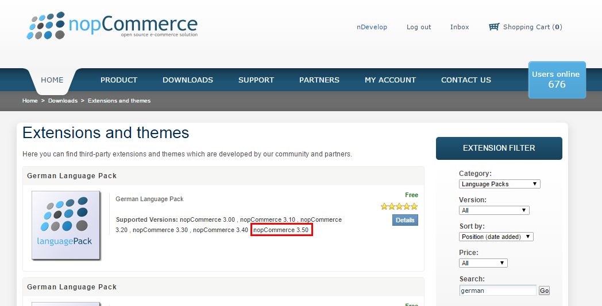

Title: nopCommerce - Open Source E-Commerce mit .NET
Published: 2016-03-17
Tags: ["eCommerce", "nopCommerce", ".NET", "CSharp", "ASP.NET MVC"]
Image: ../images/blog-title-10.jpg
---
Wenn man sich nach Open Source-Lösungen für E-Commerce umschaut, findet man meistens Magento, Shopware, PrestaShop, 
osCommerce und noch einige andere. Was haben diese Plattformen gemeinsam? Sie sind in PHP entwickelt. 
Menschen wie ich, die PHP nicht für eine Programmiersprache, sondern eher für ein Folterinstrument halten, sind von diesem 
Fakt selten begeistert. Gibt es denn keine vernünftige E-Commerce-Plattform, die man auch als .NET-Entwickler komfortabel 
nach den eigenen Wünschen erweitern kann?  Doch, die gibt es. [nopCommerce](http://www.nopcommerce.com/) ist eine 
E-Commerce-Lösung, die auf ASP.NET MVC basiert. Sie verfolgt ein Plug-in-Konzept, dass es Entwicklern recht leicht macht, 
eigene Erweiterungen modular zu entwickeln. In dieser Beitragsreihe möchte ich nopCommerce mit seinen Stärken und natürlich 
auch mit seinen Schwächen vorstellen. Ihr braucht also keine Angst haben, dass es sich hier um eine 
Verkaufsveranstaltung handelt. :-)

nopCommerce wirbt auf der Website damit, die größte .NET-E-Commerce-Plattform zu sein. Wie wir bereits festgestellt haben, 
ist das allerdings auch nicht besonders schwierig, da alle großen Konkurrenten auf PHP basieren.
Also was kann diese Plattform wirklich?<!-- Read More -->

## Installation
Werfen wir mal einen Blick unter die Haube. Da wir in den folgenden Beiträgen zum Thema nopCommerce auch auf die Entwicklung 
eigener Plug-ins, sowie die Anpassung des nopCommerce-Kerns anschauen wollen, laden wir uns bereits jetzt nopCommerce in 
Form des Quelltextes herunter, den wir nach der Registrierung auf nopcommerce.com kostenfrei erhalten. Wir nehmen dabei 
natürlich die neuste Version. Am heutigen Tag handelt es sich dabei um die Version 3.50.

Im heruntergeladenen Zip-Archiv finden wir eine Visual Studio-Solution. Nach dem öffnen der selbigen müssen wir unter 
Umständen noch das Start-Projekt festlegen. 
Das auserwählte Projekt nennt sich **Nop.Web** und befindet sich im Ordner **Presentation**.
Wie jedes größere System braucht auch nopCommerce eine Datenbank in der es alle relevanten und weniger relevanten Daten 
persistieren kann. nopCommerce setzt dabei auf den Microsoft SQL-Server. Hier tut es natürlich auch die Express-Version. 
Diesen sollten Sie natürlich vor dem Start der Solution installiert und gestartet haben.

## Erster Start
Ein Druck auf F5 schmeißt den IIS Express an und erweckt das Projekt zum Leben. Uns begrüßt ein Formular zur Eingabe, 
der für die Installation notwendigen Daten. Die Installation ist im Grunde selbsterklärend. Nach den Angaben zum 
Administrator-Konto, müssen einige Angaben zur Datenbank gemacht werden. Außerdem kann auch gleich ein Satz an Beispieldaten 
installiert werden. Dieser ist ganz hilfreich, da man so keinen leeren Shop vorfindet, sondern sich im Anschluss an 
die Installation schon einen sinnvollen Überblick verschaffen kann.

 

Gar nicht schlecht für den Anfang. So sieht also eine "nackte" nopCommerce-Installation aus.

Es gibt bereits einige Produkte, die wiederum in einer handvoll Kategorien liegen. Außerdem sind auch Geschenkgutscheine 
bereits in den Beispieldaten vorhanden. Am besten klickt ihr euch einfach durch den ganzen Shop und schaut euch um.

## Der Administrationsbereich
Das ist also der Shop. Aber so richtig interessant wird es ja bekanntlich erst im Administrationsbereich. 
Der Link zum Admin-Bereich befindet sich am oberen Rand. Voraussetzung dafür ist natürlich, dass ihr mit dem 
Administrator-Konto eingeloggt seid.

Ein Klick auf den Link zum Administrationsbereich bringt uns direkt zum Herzen des Onlineshops. Bereits auf dem Dashboard 
sind viele hilfreiche Daten dargestellt. Hier sehen wir auf einen Blick die Umsätze der letzten Tage, Wochen, Monate und Jahre.

Auch hier die Aufforderung: Klickt euch einfach mal durch den Administrationsbereich. Die meisten Menüs sind selbsterklärend. 
Besonders interessant, gerade am Anfang, ist vermutlich die Artikelverwaltung, die unter 
**Catalog >> Products >> Manage Products** findet.

## Gibt es das auch auf Deutsch?
Bisher ist der gesamte Shop inklusive Administrationsbereich noch auf Englisch. Aber gibt es das nicht auf Deutsch? Na klar. 
Auf nopCommerce.com findet man eine große Auswahl von Language-Packs. Darunter natürlich auch eines für die deutsche Sprache. 
Unter Downloads >> Extensions and themes kann man über die Filter-Box auf der rechten Seite die Suche entsprechend präzisieren. 
Es ist nur darauf zu achten, dass das Language-Pack auch für die genutzte nopCommerce-Version kompatibel ist (siehe Screenshot).

Hat man das Language-Pack heruntergeladen, kann man im Administrationsbereich einfach eine neue Sprache anlegen.

Nach einem Klick auf **Save and Continue Edit** kann die heruntergeladene Sprachdatei importiert werden. Das war schon alles.

## Wie geht es weiter?
Das liegt an euch! Wer Interesse an nopCommerce gefunden hat, der sollte ab und zu mal wieder reinschauen. 
Im nächsten Beitrag wird es um die Architektur von nopCommerce und die Erweiterbarkeit von nopCommerce gehen.